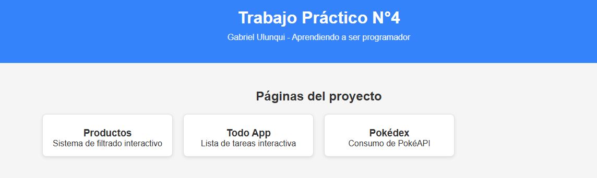
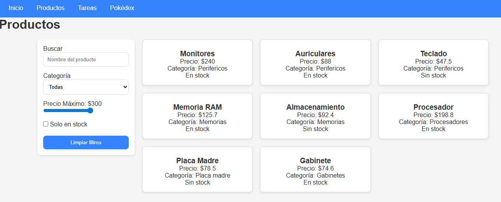
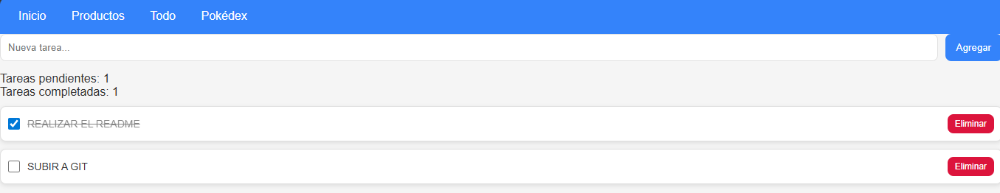
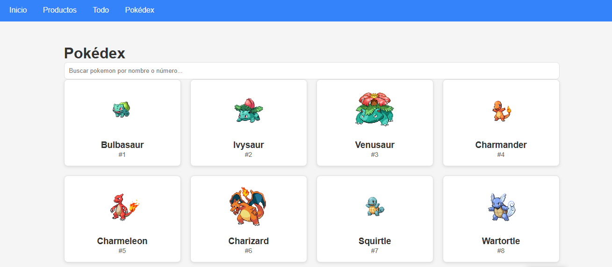

# 💻 TP4 - Programador Junior

## 📌 Descripción

Proyecto web desarrollado con HTML, CSS y JavaScript que incluye múltiples funcionalidades: filtrado de productos, lista de tareas y consumo de API externa.

---

## 📂 Páginas del proyecto

### 🛍 Productos

Sistema de filtrado interactivo que permite:

* Filtrar por categoría
* Filtrar por precio máximo
* Mostrar solo productos en stock
* Buscar por nombre
* Resetear filtros

---

### ✅ Todo App

Aplicación de lista de tareas que permite:

* Agregar tareas
* Marcar tareas como completadas
* Eliminar tareas
* Contador de tareas pendientes
* Contador de tareas completadas

---

### 🔍 Pokédex (API Demo)

Aplicación que consume la API de Pokémon utilizando Fetch:

* Muestra lista de Pokémon
* Búsqueda por nombre o número
* Renderizado dinámico de tarjetas
* Manejo de estados (loading, error, vacío)

---

## 🛠 Tecnologías utilizadas

* HTML5
* CSS3 (Flexbox + Grid + Variables CSS)
* JavaScript ES6+
* Fetch API
* API utilizada: https://pokeapi.co/

---

## 📸 Capturas de pantalla

### 🏠 Inicio



### 🛍 Productos


### ✅ Todo App



### 🔍 Pokédex



---

## 🚀 Cómo usar el proyecto

1. Clonar el repositorio:

```bash
git clone https://github.com/GabrielUlunqui/TP4-PRODUCTO-TODO-Y-API
```

2. Abrir el proyecto en Visual Studio Code

3. Ejecutar con Live Server:

* Click derecho en `index.html`
* "Open with Live Server"

---

## 🌐 Deploy

El proyecto está publicado en GitHub Pages:

👉 https://gabrielulunqui.github.io/TP4-PRODUCTO-TODO-Y-API/

---
## Estructura

```
/TP4 PP
│── index.html
│── productos.html
│── todo.html
│── api-demo.html
│
├── css/
│   └── app.css
│
├── js/
│   ├── Productos.js
│   ├── todo.js
│   └── api-demo.js
│    └── ejercicio.js
│
└── CAPTURA/
    ├── inicio.png
    ├── productos.png
    ├── todo.png
    └── pokedex.png
```

## 📌 Autor

Gabriel Ulunqui
